# FSS - Network Security Support Engineer 7.2


# Table of Contents

1. [Sessions, Traffic Flow, and Networking](#sessions-traffic-flow-and-networking)
    1. [Connectivity](#connectivity)
    2. [Interfaces and Routing](#interfaces-and-routing)
2. [Security Fabric](#security-fabric)
    1. [Security Fabric Components](#security-fabric-components)
    2. [Security Fabric Communications](#security-fabric-communications)
    3. [Troubleshooting Communication](#troubleshooting-communication)
    4. [Downstream Communication Issues](#downstream-communication-issues)
    5. [Real-Time Application Debug](#real-time-application-debug)
    6. [High CPU Usage Caused by csfd](#high-cpu-usage-caused-by-csfd)
    7. [High Memory Usage caused by csfd](#high-memory-usage-caused-by-csfd)
    8. [Automation Stitches](#automation-stitches)
        1. [Automation Stitches Testing](#automation-stitches-testing)
        2. [Automation Stitches Debug](#automation-stitches-debug)
        3. [Automation Stitches Log Dumping](#automation-stitches-log-dumping)
        4. [View Automation Stitch Settings](#view-automation-stitch-settings)
        5. [View Automation Stitch Statistics](#view-automation-stitch-statistics)
        6. [View Running Automation Stiches](#view-running-automation-stiches)
3. [Firewall Authentication](#firewall-authentication)
    1. [Diagnostic Steps for Authentication Issues](#diagnostic-steps-for-authentication-issues)
    2. [Monitoring Authenticated Users](#monitoring-authenticated-users)
    3. [Authentication Real-Time Debug](#authentication-real-time-debug)
    4. [LDAP Tree Example](#ldap-tree-example)
    5. [LDAP Regular Bind Flow -- Group Query](#ldap-regular-bind-flow-group-query)
    6. [Common LDAP Misconfigurations](#common-ldap-misconfigurations)
    7. [Windows AD Regular Bind Configuration](#windows-ad-regular-bind-configuration)
    8. [Authentication Test Command](#authentication-test-command)
    9. [LDAP Real-Time Debug](#ldap-real-time-debug)
    10. [LDAP Sniffer](#ldap-sniffer)
    11. [Common Problems](#common-problems)
    12. [RADIUS Authentication Troubleshooting](#radius-authentication-troubleshooting)
        1. [Testing RADIUS Queries](#testing-radius-queries)
        2. [RADIUS Real-Time Debug](#radius-real-time-debug)
4. [Fortinet Single Sign-On (FSSO)](#fortinet-single-sign-on-fsso)
    1. [FSSO Modes](#fsso-modes)
    2. [FSSO Components](#fsso-components)
    3. [Group Membership Check](#group-membership-check)
    4. [Workstation Check](#workstation-check)
    5. [IP Address Change Verification](#ip-address-change-verification)
    6. [Additional Requirements](#additional-requirements)
    7. [FSSO Troubleshooting Checklist](#fsso-troubleshooting-checklist)
    8. [Recommended Troubleshooting Steps](#recommended-troubleshooting-steps)
        1. [CA Logs](#ca-logs)
    9. [Tracking a Specific User](#tracking-a-specific-user)
    10. [Checking FortiGate to Collector Agent Connectivity](#checking-fortigate-to-collector-agent-connectivity)
    11. [Windows DC Login Events](#windows-dc-login-events)
    12. [Listing Active FSSO Users](#listing-active-fsso-users)
    13. [Other FortiGate FSSO Commands](#other-fortigate-fsso-commands)
    14. [Other Troubleshooting Commands](#other-troubleshooting-commands)
    15. [Agentless Polling Mode](#agentless-polling-mode)
    16. [Common Problems](#common-problems)
    17. [DNS Resolution Errors](#dns-resolution-errors)
    18. [Login Override](#login-override)
    19. [Not Verified Status in the Collector Agent](#not-verified-status-in-the-collector-agent)
5. [Security Profiles](#security-profiles)
    1. [FDN Status on FortiGate](#fdn-status-on-fortigate)
    2. [FortiGuard Web Filtering and Antispam](#fortiguard-web-filtering-and-antispam)
    3. [FortiGuard Antivirus and IPS](#fortiguard-antivirus-and-ips)
    4. [FortiGuard Troubleshooting, Web Filtering and Antispam](#fortiguard-troubleshooting-web-filtering-and-antispam)
    5. [FortiGuard Weight Calculation](#fortiguard-weight-calculation)
    6. [FortiGuard Common Issues, Web Filtering and Antispam](#fortiguard-common-issues-web-filtering-and-antispam)
    7. [FortiGuard Flags](#fortiguard-flags)
    8. [FortiGuard Troubleshooting, Antivirus and IPS](#fortiguard-troubleshooting-antivirus-and-ips)
    9. [FortiGuard Troubleshooting Tips](#fortiguard-troubleshooting-tips)
6. [Life of a packet](#life-of-a-packet)
    1. [Life of a packet, ingress](#life-of-a-packet-ingress)
    2. [Life of a packet, Routing and Firewall policy](#life-of-a-packet-routing-and-firewall-policy)
    3. [Life of a Packet, Protection Profile Inspection](#life-of-a-packet-protection-profile-inspection)
    4. [Life of a Packet, Egress](#life-of-a-packet-egress)
7. [Web Filtering](#web-filtering)
    1. [Web Filter Log, GUI](#web-filter-log-gui)
    2. [Web Filtering Statistics](#web-filtering-statistics)
    3. [FortiGuard Web Filtering Real-Time Debug](#fortiguard-web-filtering-real-time-debug)
    4. [FortiGuard Web Filtering Cache](#fortiguard-web-filtering-cache)
    5. [Web Filtering Troubleshooting Tips](#web-filtering-troubleshooting-tips)
8. [SSL Inspection](#ssl-inspection)
    1. [SSL Certificate Inspection and Full SSL Inspection](#ssl-certificate-inspection-and-full-ssl-inspection)
    2. [Full SSL Inspection](#full-ssl-inspection)
    3. [Certificate Warnings During Full SSL Inspection](#certificate-warnings-during-full-ssl-inspection)
    4. [Full SSL Inspection and HSTS](#full-ssl-inspection-and-hsts)
9. [Antivirus](#antivirus)
    1. [Antivirus Order of Operations](#antivirus-order-of-operations)
    2. [Antivirus log](#antivirus-log)
    3. [How to Investigate an Infection](#how-to-investigate-an-infection)
10. [IPS Troubleshooting](#ips-troubleshooting)
    1. [IPS Engine](#ips-engine)
    2. [IPS Fail Open](#ips-fail-open)
    3. [Monitoring IPS Fail Open Events](#monitoring-ips-fail-open-events)
    4. [Frequent IPS Fail Open Events](#frequent-ips-fail-open-events)
    5. [IPS Engine's Role in Identifying Protocols](#ips-engines-role-in-identifying-protocols)
    6. [IPS and High CPU Usage](#ips-and-high-cpu-usage)
    7. [False Positives](#false-positives)
    8. [False Negatives](#false-negatives)
11. [High Availability](#high-availability)
    1. [HA Configuration Synchronization and Status](#ha-configuration-synchronization-and-status)
        1. [Processes Involved](#processes-involved)
        2. [Heartbeats, Generating HB Packets](#heartbeats-generating-hb-packets)
        3. [Heartbeats, Receiving and Processing HB Packets](#heartbeats-receiving-and-processing-hb-packets)
       4. [Checking the Status of HA on the GUI](#checking-the-status-of-ha-on-the-gui)
       5. [Connecting to CLI on Secondary  Device](#connecting-to-cli-on-secondary-device)
       6. [HA Status](#ha-status)
       7. [Checking the HA Time Difference](#checking-the-ha-time-difference)
       8. [Checking the Configuration Synchronization](#checking-the-configuration-synchronization)
    2. [Session Synchronization](#session-synchronization)
        1. [HA Session Synchronization](#ha-session-synchronization)
        2. [Session Synchronization](#session-synchronization)
        3. [Checking HA Session Synchronization](#checking-ha-session-synchronization)
    3. [HA Troubleshooting](#ha-troubleshooting)
        1. [Types of Failover](#types-of-failover)
        2. [HA History](#ha-history)
        3. [HA Split-Brain Scenario](#ha-split-brain-scenario)
        4. [HA Split-Brain, Troubleshooting Steps](#ha-split-brain-troubleshooting-steps)
        5. [HA Troubleshooting Tips](#ha-troubleshooting-tips)
        6. [HA Heartbeat Troubleshooting Tips](#ha-heartbeat-troubleshooting-tips)
12. [IPsec](#ipsec)
    1. [Monitor IPsec VPN tunnels](#monitor-ipsec-vpn-tunnels)
        1. [IPsec SA Management](#ipsec-sa-management)
        2. [IPsec SA](#ipsec-sa)
        3. [IPsec Tunnel Details](#ipsec-tunnel-details)
        4. [IKE Gateway List](#ike-gateway-list)
        5. [Additional IPsec Debug Commands](#additional-ipsec-debug-commands)
    2. [Debug an IPsec VPN Connection](#debug-an-ipsec-vpn-connection)
        1. [IKE Filter Options](#ike-filter-options)
        2. [IKE Real-Time Debug](#ike-real-time-debug)
        3. [Debugging Main Mode](#debugging-main-mode)
    3. [IPsec Traffic and Hardware Offload](#ipsec-traffic-and-hardware-offload)
        1. [Hardware Offloading Requirements](#hardware-offloading-requirements)
        2. [Session NPU-Flag field](#session-npu-flag-field)
        3. [Hardware Offloading Statistics](#hardware-offloading-statistics)
    4. [IPsec Troubleshooting](#ipsec-troubleshooting)
        1. [IPsec Connection Steps](#ipsec-connection-steps)
        2. [Capturing IKE Traffic](#capturing-ike-traffic)
        3. [Common IPsec Problems](#common-ipsec-problems)
13. [IPsec IKEv2](#ipsec-ikev2)
    1. [IKEv1 and IKEv2 Comparison](#ikev1-and-ikev2-comparison)
        1. [IKEv1, An Outdated Version](#ikev1-an-outdated-version)
        2. [Reasons to Continue Using IKEv1](#reasons-to-continue-using-ikev1)
        3. [IKEv2 Overview](#ikev2-overview)
        4. [IKEv2 Advantages](#ikev2-advantages)
    2. [IKEv2 Exchange Process](#ikev2-exchange-process)
        1. [IKEv2, A Request and Response Protocol](#ikev2-a-request-and-response-protocol)
        2. [IKEv2 Negotiation Steps](#ikev2-negotiation-steps)
        3. [IKEv2 Exchange Process, IKE_SA_INIT](#ikev2-exchange-process-ike_sa_init)
    3. [Monitor and Debug IKEv2](#monitor-and-debug-ikev2)
        1. [IKEv2 Monitor, Debug and Troubleshoot Commands](#ikev2-monitor-debug-and-troubleshoot-commands)
14. [Routing](#routing)
    1. [General Concepts and Troubleshooting](#general-concepts-and-troubleshooting)
        1. [Route Lookup](#route-lookup)
        2. [Route Lookup Process](#route-lookup-process)
        3. [Route Selection Process](#route-selection-process)
        4. [Static Routes](#static-routes)
        5. [Return Packet Routing](#return-packet-routing)
        6. [Asymmetric Routing](#asymmetric-routing)
        7. [Routing Changes Without SNAT](#routing-changes-without-snat)
        8. [Routing Changes and SNAT Sessions](#routing-changes-and-snat-sessions)
        9. [ECMP Acceleration with Auxiliary Session](#ecmp-acceleration-with-auxiliary-session)
        10. [Routing Table](#routing-table)
        11. [Routing Table Database](#routing-table-database)
        12. [FIB](#fib)
        13. [Route Cache](#route-cache)
        14. [Policy Route Table](#policy-route-table)
15. [BGP](#bgp)
    1. [BGP Review](#bgp-review)
        1. [AS](#as)
        2. [BGP Components](#bgp-components)
        3. [RIBs](#ribs)
        4. [BGP attributes](#bgp-attributes)
        5. [Route Selection](#route-selection)
        6. [BGP Summary](#bgp-summary)
        7. [BGP Neighbors](#bgp-neighbors)
        8. [Prefixes Advertised by the Local FortiGate](#prefixes-advertised-by-the-local-fortigate)
        9. [Prefixes Advertised by a Neighbor](#prefixes-advertised-by-a-neighbor)
        10. [Prefixes Advertised by All BGP Peers](#prefixes-advertised-by-all-bgp-peers)
        11. [BGP Event Logging](#bgp-event-logging)
    2. [BGP Troubleshooting](#bgp-troubleshooting)
        1. [BGP Troubleshooting Tips](#bgp-troubleshooting-tips)
        2. [Real-Time Debug](#real-time-debug)
        3. [Restart BGP](#restart-bgp)
16. [OSPF](#ospf)
    1. [OSPF Review](#ospf-review)
        1. [OSPF Overview](#ospf-overview)
        2. [OSPF Components](#ospf-components)
        3. [Link State Advertisement](#link-state-advertisement)
        4. [Forming an Adjacency](#forming-an-adjacency)
        5. [Adjacency Requirements](#adjacency-requirements)
        6. [OSPF Neighbors](#ospf-neighbors)
        7. [OSPF LSDB](#ospf-lsdb)
        8. [OSPF Self-Originated LSAs](#ospf-self-originated-lsas)
        9. [LSA Details](#lsa-details)
    2. [OSPF Troubleshooting](#ospf-troubleshooting)
        1. [OSPF Troubleshooting Tips](#ospf-troubleshooting-tips)
        2. [Advertised Route Not in Routing Table](#advertised-route-not-in-routing-table)
        3. [OSPF Logging](#ospf-logging)

<div style="page-break-before:always">&nbsp;</div>
<p></p>
\newpage

# Sessions, Traffic Flow, and Networking

## Connectivity

- Connect
    - Browser to connect to IP interface for admin access.
    - Login
    - GUI Dashboard displayed by default.

## Interfaces and Routing

Fortigate Interface settings:
- Alias:
- IP
- Administrative Access
- DHCP servers


# Security Fabric

- Intelligent architecture interconnecting security solutions
   - Detects, blocks, and remediates attacks across attack surface
- Supports Hardware, Virtual, Cloud

## Security Fabric Components

- Core
   - Root FortiGate
   - Downstream FortiGate
   - FortiAnalyzer or Fortinet Cloud logging Service
- Recommended
   - FortiManager, FortiAP, FortiSwitch, FortiClient, FortiSandbox, FortiMail
- Extended 
   - Other Fortinet products and third-party products using the API
    
## Security Fabric Communications

- Protocols
  - Uses TCP:8013
   - Always on
   - Must be manually enabled on FortiGate interface under Adminsitrative Access
    
- Neighbor Discovery
  - Uses UDP:8014
  - Broadcast messages every 60 seconds
  - Responsible for security logging behavior

### Troubleshooting Communication

- Unable to connect to root
- Common Issues
  -  Administrative access disabled for Security Fabric on upstream FortiGate
  - FortiOS firmware mismatch
  - Device has not been authorized yet on root
  - Wrong root IP address
  - FortiGate not in NAT mode
  - TCP port 8013 blocked
  - UDP port 8014 

### Downstream Communication Issues

> FortiTelemetry disabled
```
> diagnose sniffer packet any "tcp port 8013 or udp port 8014" 4
```

> Troubleshooting FortiGate paring root, non-root.
```
> diagnose test application csfd 1
```

> Gather upstream and downstream device information.
```
> diagnose sys csf upstream
> diagnose sys csf downstream
> diagnose sys csf global
```

### Real-Time Application Debug

- csfd is the daemon responsible for anything related to the Security Fabric
- Useful to troubleshoot issues such as a frozen GUI

```
> diagnose debug application csfd -1
> diagnose debug enable
```


### High CPU Usage Caused by csfd

- Outputs to gather if csfd causes high CPU
- Helpful for Fortinet Support

```
> diagnose debug application csf -1
> diagnose debug enable

> diagnose sys process dump <csfd_pid>
> diagnose sys process pstack <csfd_pid>
> diagnose sys process trace <csfd_pid>
```

### High Memory Usage caused by csfd

- Outputs to gather if csfd causes high memory usage

```
> diagnose  test application csfd 1 - show stats
> diagnose  test application csfd 4 - start diagnostic collection
> diagnose  test application csfd 7 - print diagnostics stats
> diagnose  test application csfd 10 - show query cache status
> diagnose  test application csfd 30 - show process information
> diagnose  test application csfd 40 - show MAC cache status
> diagnose  test application csfd 100 - Dump registered elements
> diagnose  test application csfd 130 - List of open sockets
> diagnose  test application csfd 142 - List of unconfirmed open msgs
> diagnose  test application csfd 150 - Dump table counts

```

## Automation Stitches

- Automate actions among different systems in the Security Fabric
  - Decrease response times to security events
- Can be configured only on the root
- Events within the entire Security Fabric can be monitored
- Consists of a trigger and an action(s)
  - Trigger: an event that triggers an action, such as a failed login attempt
  - Action: the resulting response to the trigger, such as a notification email sent to the administrator
  - You can set a minimum interval to avoid too many notifications
- Use CLI commands to test, log and display settings and statistics
  - Can be run from any Fortigate in the Security Fabric


### Automation Stitches Testing

- Manually test an automation stitch
```
> diagnose automation test
> diagnose automation test HAFailOver
```

### Automation Stitches Debug

- Real-time application debug
```
> diagnose debug application autod -1
> diagnose debug enable
> diagnose automation test ConfigurationChange
```

### Automation Stitches Log Dumping

- Enable log dumping to view log statistics
```
> diagnose test application autod 1 # Enable
> diagnose test application autod 1 # Disable
```

### View Automation Stitch Settings

```
> diagnose test application autod 2
```

### View Automation Stitch Statistics

```
> diagnose test application autod 3
```

### View Running Automation Stiches

```
FGTVM-2 # diagnose test application autod 5
```

# Firewall Authentication

## Diagnostic Steps for Authentication Issues

- Fortigate using LDAP, NTLM, RADIUS and so on
  - Can users authenticate?
  - Are users being given the proper permission
- What do the event logs show?
  - Was authentication successful at first but problems ocurred later?
  - Is the username correct?
- What do the logs show?
  - Is traffic being blocked?
  - Are users being treated with the proper profiles?
- What do the server logs show?
  - FortiGate bases decisions on server responses

## Monitoring Authenticated Users

- Firewall User Monitor is not on the GUI by default, it must be enabled.

```
> diagnose firewall auth filter [source | policy | user | group | method]
> diagnose firewall auth list
```

## Authentication Real-Time Debug

```
> diagnose debug application authd -1
```

## LDAP Tree Example

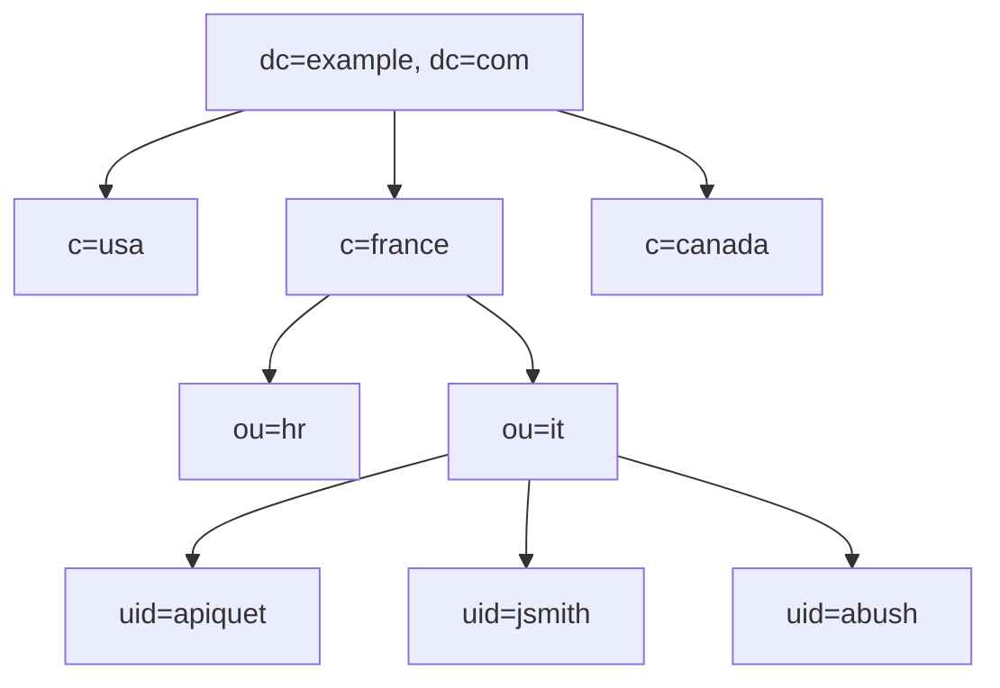
> (DN: uid=jsmith, ou=it, c=france, dc=example, dc=com)

## LDAP Regular Bind flow -- Group Query

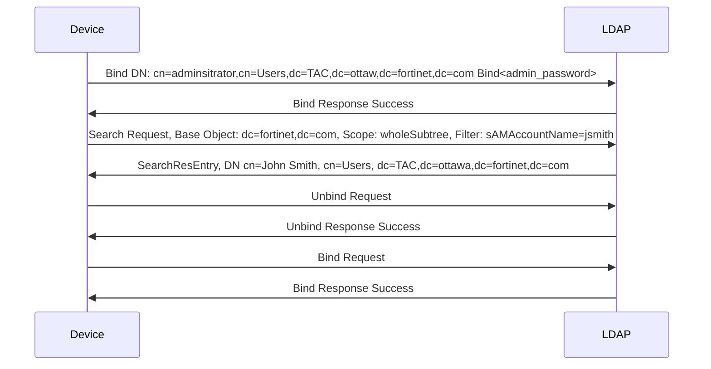

## Common LDAP Misconfigurations

- Common Name Identifier
  - cn for full name
  - sAMAccountName for login-name

- Distinguished Name
- Username
- Password

## Windows AD Regular Bind Configuration

- To see the DN
```
> dsquery user -name <full_user_name>
> dsquery user -samid <login_username>
```
## Authentication Test Command

```
> diagnose test authserver ldap <server_name> <user> <password>
```

## LDAP Real-Time Debug

```
> diagnose debug application fnbamd -1
> diagnose debug enable
```

## LDAP Sniffer

```
> diagnose sniffer packet any "port 389" 3
```
- Error Codes
  - 0x525: user not found
  - 0x52e: invalid credentials
  - 0x530: not permitted to logon at this time
  - 0x531: not permitted to logon from this workstation
  - 0x532: password expired
  - 0x533: account disabled
  - 0x701: account expired
  - 0x773: user must reset password
  - 0x775: account locked out

## Common Problems

- User Not Found
```
get_all_dn-Found no DN
start_next_dn_bind-No more DN left
```
- Wrong User Password
```
fnbamd_ldap_get_result-Auth Denied
```
- Groups Not Found
```
> get_member_of_groups-attr='groups' - found 0 values
```

## RADIUS Authentication Troubleshooting

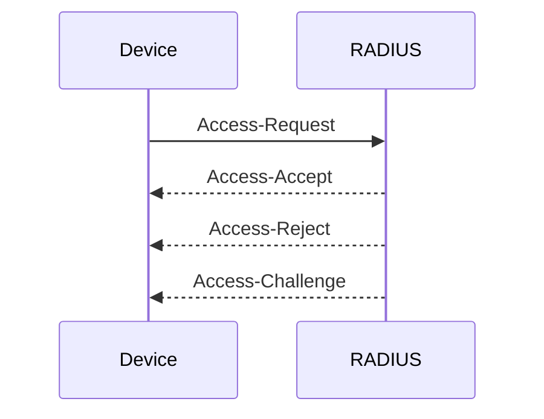


### Testing RADIUS Queries

- Supported Schemes
  - chap
  - pap
  - mschap
  - mschap2
```
> diagnose test authserver radius <server_name> <scheme> <user> <password>
```

### RADIUS Real-Time Debug

```
> diagnose debug application fnbamd -1
> diagnose debug enable
```

# Fortinet Single Sign-On (FSSO)


## FSSO Modes

- Agent-based FSSO
  - Logon events pushed to the collector agent in real time
- Agentless FSSO
  - NetAPI
    - Polls NetSessionEnum API
  - WinSecLog
    - Polls all security event logs
    - Polls can be done directly from the FortiGate (agentless polling)
  - WMI
    - Polls specific security event logs
> The poll intervals are estimated and depend on the number of servers and network latency

## FSSO Components

- Phase I
  - User Login Event
- Phase II
  - Collecting login info
  - Gathering user group memberships
- Phase III
  - Sending and receiving authentication details

 ```mermaid

graph LR
FortiGate --> |TCP 445|WindowsDOM(Windows domain controller without agent)

WS(Windows server with collector agent) --> |TCP 8000|FortiGate
WS --> |TCP 445|WindowsDOM

WDC(Windows domain controller with DC agent)-->|UDP 8002|WS
WTS(Terminal or Citrix server)-->|UDP 8002|WS


GC7(Client) --> WDC
GC8(Client) --> WDC
GC9(Client) --> WDC

GC4(Client) --> WTS
GC5(Client) --> WTS
GC6(Client) --> WTS

GC1(Client) --> WindowsDOM
GC2(Client) --> WindowsDOM
GC3(Client) --> WindowsDOM

 ``` 

## Group Membership Check

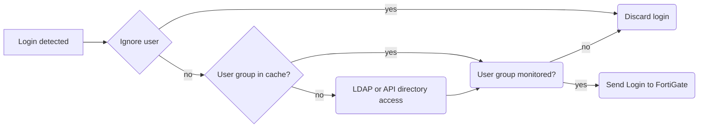

## Workstation Check

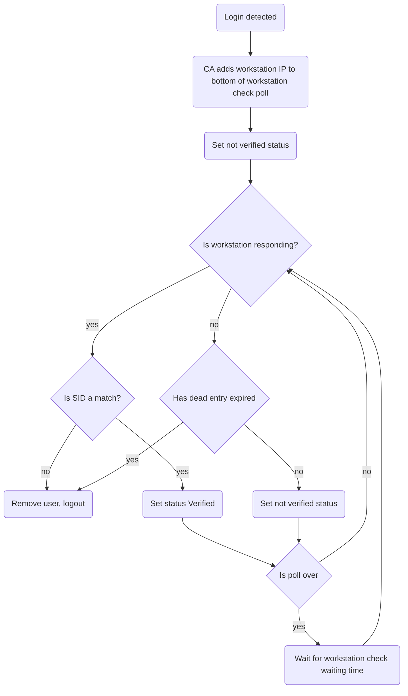

## IP Address Change Verification

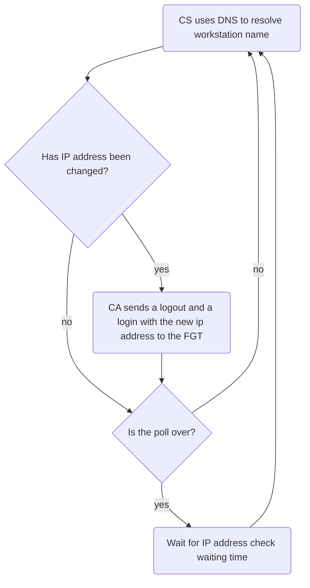

## Additional Requirements

- TCP ports 139 and 445 must be open between collector agent and workstations
- Remote registry service must be up and running on each workstation
  - Collector agent periodically verifies that user is still logged in to the workstation
- Ensure that workstations have proper DNS registration and that the DNS server is updated whenever the IP address changes


## FSSO Troubleshotting Checklist

- Is the TCP connection between FortiGate and the collector agent established?
- Is the collector agent properly monitoring all DCs?
- Is the domain controller generating the login events?
- Is the collector agent getting login events?
- Does the collector agent list the active FSSO users?
- Is FortiGate receiving login events?
- Does FortiGate list the active FSSO users?
- Are the user's group information and authentication rules properly configured?

## Recommended Troubleshooting Steps

- Configuration and topology information
  - FSSO version
  - A copy of the exported configuration of FSSO registry from all DC's(dcagent mode) Network topoligy information for polling modes (including number of DCs)
  - FortiGate configuration file

- When the issue occurs, collect the following information
  - A copy of log file from all collector agents
  - The workstation output under the affected user account

```
  # diag debug enable
  # diag debug auth fsso list
```
  
  ### CA Logs

  - Information level shows all FSSO events
  - Log events to separate log file
  - If there are many FSSO events increase the log file size to 100 MB


## Tracking a Specific User

- Perform the user login
- Check which DC recorded the login event
  - cmd.exe > echo %logonserver% 
- Check the login event using the Windows event viewer
- In the collector agent
  - Check logs and the list of active FSSO users
  - Check that the user group is listed in the group filter
- FortiGate
  - Check logs to verify that the login event was recevied
  - Check the list of active FSSO users
  - Generate traffic from the user workstation and verify that the user is listed in the FortiGate user monitor

## Checking FortiGate to Collector Agent Connectivity

- Show Service Status
  - Verify connected FortiGates

- FortiGate real-time debug connection
```
> diagnose debug application authd 8256
> diagnose debug enable
```
- Collector Agent to DC Connectivity
  - Show Monitored DCs in Collector Agent


## Windows DC Login Events

- Use Windows Event Viewer
  - Search event IDs 4768, 672, 680, and 4776 with audit success

## Listing Active FSSO Users

- Show Logon Users in Collector Agent
```
> diagnose debug authd fsso list
```


## Other FortiGate FSSO Commands

- Request Collector Agent to resend active users list to FortiGate
```
> diagnose debug authd fsso refresh-logons
```

- Clear login information in FortiGate
```
> diagnose deb authd fsso clear-logons
```
  -  Users must logoff/logon

- Request Collector Agent to resend monitored groups list to FortiGate
```
> diagnose debug authd fsso refresh-groups
```
- List monitored groups
```
> get user adgrp
```

## Other Troubleshooting Commands

- Use these commands on cmd.exe
- Windows/LDAP

- Show DN name
```
dsquery user -name <user_name>
```
- Show user group memberships
```
dsquery user -name <user_name> | dsget user -memberof
```

- Who is logged in to the workstation
```
wmic /user:administrator@domain.com /password:*** /node:"<WST_IP>" computersystem get username
```

- Shows if port is open
```
c:\netstat -a o n
```

## Agentless Polling Mode

```
> diagnose debug fsso-polling detail
```

```
> diagnose debug fsso-polling refresh-user
```

```
> diagnose sniffer packet any 'host 10.124.2.18 and tcp port 445'
```

```
> diagnose debug application fssod -1
> diagnose debug enable
```

- Common errors
  - FortiGate cannot resolve the active directory server name
    - failed to resolve server (<server name>)
  - FortiGate and AD system times must be in sync so that statistics can be calculated correctly
    - Please sync the time of Fortigate and AD server
  - Check FortiGate memory usage
    - No memory alloc


## Common Problems

- Collector agent does not have the login information
  - Verify that the collector agent is monitoring all DCs
  - Check that the collector agent is receiving login events from the DCs
  - Test the user account and check the collector agent logs
- Collector agent has the login information, but FortiGate does not
  - Check that FortiGate is connected to the collector agent
  - Run the real time debug while testing the user account
- User is listed as active in FortiGate but cannot browse the internet
  - Check the user IP address in the list of active FSSO users
  - Check the user's group information
  - Check the firewall policies
  - Check the collector agent logs
- FortiGate is randomly blocking some users
  - Check that the collector agent service is not crashing
  - Check for crashes in any of the FortiGate processes
  - Check that the connectivity between FortiGate and the collector agent is stable
  - Try to reproduce and check the collector agent logs

## DNS Resolution Errors

- DNS cannot resolve the workstation name
- The collector agent logs show
  - DnsQuery() failed for WORKSTATION1, error code:9003

## Login Override

  - The collector agent ignores login events from anonymous accounts and accounts with names starting with '$'
  - However, some applications generate login events with different system accounts, overriding the user login event
    - Microsoft MOM
    - RDP
  - Solution
    - Find the account in the collector agent logs that is overriding the user
    - Add the account to the collector agent ignore user list


## Not Verified Status in the Collector Agent

- The collector agent cannot verify if the user is still logged in
  - The following entries are generated in the collector agent logs
    - failed to connect to workstation
    - failed to connect to registry
- Common Causes
  - A firewall is blocking traffic to port 139 and 445
  - The workstation remote registry service is not running


## No Internet After IP Address Change
- This problem might happen when
  - A workstation is moved between LAN and WiFi
  - A workstation is back from hibernate mode
- Check the workstation name DNS resolution
  - The collector agent relies on DNS to get accurate IP address
- Workaround
  - Configure FSSO guest users
- Solution
  - Configure DNS server to automatically get IP address updates
  - For multihomed scenarios (both wired and wireless connections are up), the DNS server should be able to return both IP addresses


# Security Profiles

## FDN Status on FortiGate

- Check FDN status on FortiGate under FortiGuard settings
  - System->FortiGuard

## FortiGuard Web Filtering and Antispam

1. Fortigate submits a DNS A record lookup
1. DNS replies with the IP
1. FortiGate submits a license check and server list request
1. Server status and list
1. FortiGate submits queries to one of the servers
1. If no reply in two seconds, FortiGate contacts the next server on the list
- FortiGate submits a DNS lookup to get the IP address for one of these names
  - service.fortiguard.net: UDP and worldwide servers
  - securewf.fortiguard.net: HTTPS and worldwide servers
  - usservice.fortiguard.net: UDP and USA-based-only servers
  - ussecurewf.fortiguard.net: HTTPS and USA-based-only servers


## FortiGuard Antivirus and IPS

- Pull Method
    1. FortiGate submits a DNS A record lookup for update fortiguard.net
    1. DNS replies with the IP address
    1. FortiGate periodically checks for updates in the databases
    1. FortiGate downloads updated databases

- Persistent Connection Method
    1. FortiGate submits a DNS A record lookup for update fortiguard.net
    1. DNS replies with the IP address
    1. FortiGate forms persistent secure connection to FortiGuard
    1. FortiGuard notifies that there is a new update through persistent connection
    1. FortiGate forms a separate secure connection to download the update

## FortiGuard Troubleshooting, Web Filtering and Antispam

- Round trip delay: RTT
- Server time zone: TZ
- Consecutive requests sent with no reply: Curr Lost
- Historical requests sent with no reply; resets upon device boot: Total Lost

```
> diagnose debug rating
```

## FortiGuard Weight Calculation

- Initial value is the delta between FortiGuard server time zone and FortiGate system time zone, multiplied 10
- Weight increases with each packet lost
- Weight decreases over time if no packets are lost, but never goes below the initial value
- FortiGate uses server with the lowest weight
  - if weights are the same, FortiGate uses lowest RTT


## FortiGuard Common Issues, Web Filtering and Antispam

 - Some ISPs block non-standard traffic over port 53
   - Solution: use port 8888
- Some ISPs block port 8888 traffic
  - Solution: use port 53
- Some ISPs block traffic based on the source port
  - Solution:
  ```
  config sys global
    set ip-src-port-range 1031-4999
  end
  ```

## FortiGuard Flags

- I =  Initia
  - Server contacted to request contract information and updates
- D = Default
  - IP addresses of servers received from DNS resolution
- S = Serving
  - IP addresses of servers received from FortiManager
- T = Timing
  - Actively timing this connection
  - Server remains in this state for 15 seconds (default) before being considered as failed
- F = Failed
  - Server connection has failed
  - FortiGate pings every 15 minutes to check if server has come back


## FortiGuard Troubleshooting, Antivirus and IPS

- FortiGate uses port TCP 443 to get updates
  - Can be configured to connect through a web proxy
  ```
  config system autoupdate tunneling
    set address <proxy_address>
    set password <password>
    set port <proxy_port>
    set status {enable | disable}
    set username <name>
  end
  ```
- When connecting through a web proxy, FortiGate can access FortiGuard without DNS resolution
- Automatic and Manual updates are different
  - Automatic updates download the portions of the database tthat have changed since last update
  - Manual updates download the whole database if there is a new version available
- Some FortiGuard problems can be fixed by doing a manual update
  - Example: corrupted antivirus database

  ```
  > diagnose test application dnsproxy 7
  > diagnose autoupdate status
  ```

  ## FortiGuard Update Status

```
> diagnose autoupdate versions
```

- Enable real-time debug
```
> diagnose debug application update -1
> diagnose debug enable
> execute update-now
```

## FortiGuard Troubleshooting Tips

- Can the management VDOM access the internet
  - FortiGuard traffic orginates from the management VDOM
- Does DNS work?
  - Antivirus/IPS(update.fortiguard.net)
  - Web Filtering/AS(service.fortiguard.net)
- Updates to FortiGuard contracts are not instantaneous
  - It usually takes 1 to 2 hours to update a contract on all FortiGuard servers
  - In some cases, it can take up to 24 hours

## Life of a packet

 - Four stages
    - 1. Ingress, Rate limit, ddos, rpf, header check
    - 2. Routing and firewall policy
    - 3. Protection Profile Inspection, UTM inspection
    - 4. Egress, SNAT and IPSEC

     

### Life of a packet, ingress

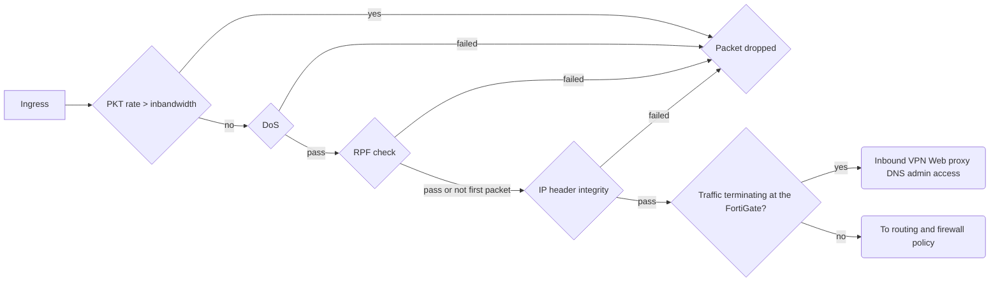

### Life of a packet, Routing and Firewall policy

- From Ingress

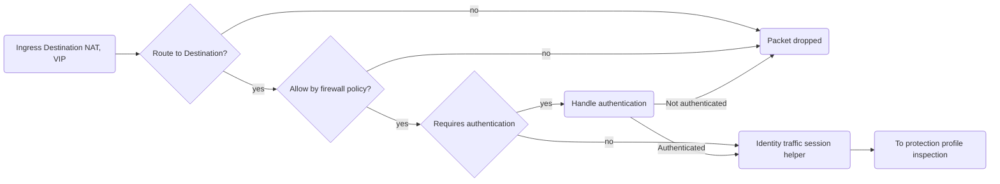


### Life of a Packet, Protection Profile Inspection

- The third stage is UTM inspection. If the traffic is encrypted and full SSL inspection is used. the FortiGate proceeds to decrypt the traffic. After that, the inspection profiles are applied in this order. IPS, application control, VoIP, DLP, antispam, web filtering and antivirus.


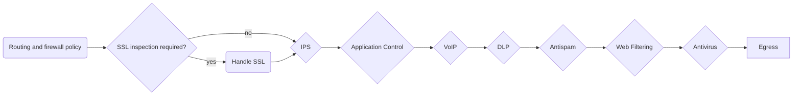


### Life of a Packet, Egress

- Egress 
  1. Traffic shaping
  2. Source NAT
  3. Outbound IPSEC

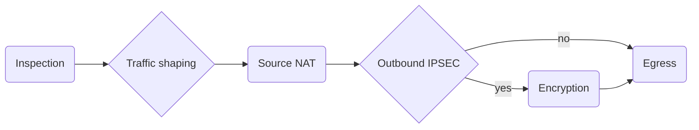

## Web Filtering

### Web Filter Log, GUI

- Log & Report > Security Events
  - Action
  - Profile used
  - Category
  - URL

### Web Filtering Statistics

```
> diagnose webfilter fortiguard statistics list
```

### FortiGuard Web Filtering Real-Time Debug

```
> diagnose debug urlfilter src-addr <source_ip>
> diagnose debug application urlfilter -1
> diagnose debug enable
```

### FortiGuard Web Filtering Cache

- Rating, FortiGuard categoriy for the domain in hexadecimal

```
> diagnose webfilter fortiguard cache dump
> get webfilter categories
```

### Web Filtering Troubleshooting Tips

- Get specifics
  - What URLs?
  - Is it random or consistent
  - Who is affected? All users or a specific user?
- Is there anything in any of the logs
  - Was something blocked intentionally?
- Is authentication involved
  - Double-check that the user is being handled correctly
- Attempt reproduction
  - You can reproduce most web filtering issues using the same settings
  - Run the real-time debug commands while reproducing the problem
- Ensure web filtering isn't globally disabled
```
> get system fortiguard
```
- Problems connecting to FortiGuard and the device entering conserve mode can cause intermittent web filtering issues


## SSL Inspection

### SSL Certificate Inspection and Full SSL Inspection

- SSL certificate inspection relies on extracting the FQDN of the URL from either
  - TLS extension server name indication (SNI)
  - SSL certificate common name (CN)

1. FortiGate tries top get the URL from the SNI field
1. If the SNI field is not present, FortiGate proceeds to inspect the server digital certificate

### Full SSL Inspection

- Full SSL inspection, Fortigate does decrypt and re-encrypt the SSL traffic and must be located inbetween the client and destination server
- FortiGate requires the private key to decrypt and inspect SSL traffic
  - Intercepts traffic coming from the server and re-signs it with its certificate and key
  - Certificate FortiGate porovides must be issued to the destination domain name

### Certificate Warnings During Full SSL Inspection

- During full SSL inspection, browsers might display a warning because they do not trust the CA
- To fix the warning, there are two options
  - Use the Fortinet_CA_SSLProxy certificate and install the FortiGate CA root certificate in all the browsers
  - Generate a new SSL proxy certificate using a private CA and install the respective root CA certificate in all the browsers
- This is not a FortiGate limitation, but a consquence of how SSL and digital certificates work

### Full SSL Inspection and HSTS

- HSTS and PKP are security features designed to detect man in the middle SSL attacks by making sure that any certificate presented when accessing a server resource is signed by a specific CA
- Some clients have specific requirements for SSL
  - PKP: Public Key Pinning
  - HSTS: HTTPS Strict Tranpport Security
- Possible Solutions
  - Exempt those websites from full SSL inspection
  - Use SSL certificate inspection instead

## Antivirus

### Antivirus Order of Operations

- FortiOS 6.4 heuristic scan could be enabled to perform antivirus inspection after the grayware scan.
- FortiOS 7.0 and later, previous heuristic settings are not kept. Thjere is a machine-learning-detection settings, which is an AI-based malware detection feature

1. Virus Scan
1. Grayware scan
1. Machine learning detection

### Antivirus log
- One of the best tools for torubleshooting antivirus issues is the FortiGate logs


### How to Investigate an Infection

- Get specifics
  - What antivirus software detected it
  - What virus did it detect
    - Virus names are not standard between vendors
  - How did the virus get inside the network?
    - Through email, website, USB stick or demo CD

- Test to see if antivirus is operating correctly
  - eicar.org, the standard AV test file
  - Could the virus have been detected by FortiGate?
  - If undetected, submit to FortiGuard with details
  - Test sample file on FortiGuard website
    - https://www.fortiguard.com/faq/onlinescanner
    - If detected, check which FortiGate AV database contains it

- Choose the antivirus database
```
config antivirus setting
  set default-db {normal | extended | extreme}
end
```

- Normal database
  - "In the wild" viruses
  - Available on all models
- Extended database
  - Default
  - "In the wild" plus some not recently active
  - Available on most models
- Extreme database
  - Only available on some models

- Examine protocol settings for infection vector
  - SSL requires deep inspection
  - Archives are examined to certain limits
    - Maximum number of subdirectories and nested archives
  - Password protected archives cannot be scanned

## IPS Troubleshooting

### IPS Engine

  - There are two IPS-related daemons
    - ipsengine handles inspection and detection tasks
    - ipshelper handles actions whose results can be shared by different daemons, to reduce load

```
> diagnose sys top
```

### IPS Fail Open

- Fail open is triggered when one of these two events happen
  - The IPS socket buffer is full and new packets can't be added for inspection
  - The FortiGate is in conserve mode
- The action of the IPS takes depends on the configuration
```
config ips global
  set fail-open <enable|disable>
  set database extended
  set traffic-submit disable
end
```
  - enable: New packets might pass through without inspection
  - disable: New packets might be dropped

### Monitoring IPS Fail Open Events

- IPS fail open event details can be seen in the crash log
```
> diagnose debug crashlog read
```
-  The packet_action value indicates whether new packets are dropped or passed through
- The crash log also indicates when IPS has exited fail open mode

### Frequent IPS Fail Open Events

- Try to identify a pattern
  - Traffic volume increases?
- Create IPS profiles specifically for the traffic type
  - Profile to protect Windows servers doesn't need Linux or Solaris signatures
  - Disable IPS on internal-to-internal policies
  
### IPS Engine's Role in Identifying Protocols

- Policy & Objects -> Protocol Options
- Protocol options are used in firewall policy to instruct FortiGate how to handle mapping destination ports to upper-layer protocols(HTTP, SMTP, FTP etc)
- Inputting a specific port number directs traffic on that destination port to the relevant processes, based on the inspection mode of that policy (flow or policy)
- When the Any setting is enabled for a protocol, the IPS engine is leveraged to inspect all destinatoin ports to determine whether the traffic is, in fact, that protocol
- Using the Any setting for one or more protocols creates more CPU load and can affect how the FortiGate processes traffic when a fail open event occurs

### IPS and High CPU Usage

- Temporary spikes in CPU usage are normal
  - Usually caused by a configuration change
  - diagnose sys top will show all ipsengine instances spike to 99% temporarily
  - Continuous high CPU use by IPS engines might be caused by an infinite loop in packet parsing
    - Symptoms might not affect all of the ipsengine instances

```
> diagnose test application ipsmonitor ?
```

### False Positives

- Check that the IPS signature database is up to date
- Determine which signature is triggering the false positive
- Use IP exemptions on the signature as a temporary bypass for the affected endpoints
- If all factors are verified (that is, correct policy match, correct IPS profile match), then collect multiple sniffer samples of the traffic
- Provide the sniffer samples and the matching logs to the FortiGuard team for further investigation
- support.fortinet.com -> FortiGuard Service Ticket

### False Negatives

- False negatives are more difficult to find
- Verify
  - Is the IPS signature database up to date?
  - Is traffic hitting the correct policy or IPS profile?
  - Is the IPS using high CPU or memory, is it crashing?
  - Is the signature action set correctly?
- Collect multiple sniffer samples, along with details of the application traffic, and provide them to the fortinet IPS team for investigation

# High Availability

## HA Configuration Synchronization and Status

### Processes Involved

- HA framework (2 daemons)
  - hatalk: cluster management + failure monitoring
  - hasync: synchronization of configuration files, upgrade process, IKE notification, external files, ARP table, and FIB

- Kernel
  - Heartbeat
  - Updating synchronization session on secondary

- Surrounding processes around hasync
  - cmdb: configuration daemon
  - update and external files
  - iked, authd, and snmpd

### Heartbeats, Generating HB Packets

- Heartbeat packets generated by kernel
  - Higher priority in scheduler compared to other processes
  - Higher priority on kernel for HA packets on egress
  - Higher priority on NP6 queues for HA packets
  - Heartbeat packet generation load distributed on multiple CPU cores

- How many cores used for heartbeat?
- Distribution of heatbeats on the CPU cores
```
> diagnose sys ha heartbeat
```

### Heartbeats, Receiving and Processing HB Packets

- HA heartbeat received by hbdev NIC
  - Heartbeat packets received by the NIC configured as hbdev
  - Higher priority given to HA heartbeat packets

- Kernel Processing
  - Separates user traffic from heatbeats based on packet ethertype
  - Stores heartbeat data in a received buffer in memory
  - Notifies HA daemon hatalk through a signal of the presence of heartbeat packets to process

  - hatalk daemon processing
    - Time stamps HA packets when called by the kernel
    - Run actively every 100 ms to run a diff time function comparing the received heartbeat packet timestamp with its current time
    - HA heartbeat timeout triggered if time_difference > hb-interval (default 200 ms) * hb-lost-threshold

### Checking the Status of HA on the GUI

- System > HA

### Connecting to CLI on Secondary  Device

- Using the CLI of the primary device, you can connect to the CLIs of any secondary devices
```
> execute ha manage <ha_unit_index> <Admin_Username>
```
- To list the index numbers for each device, use a question mark
```
> execute ha manage ?
```

### HA Status 

- Heartbeat
- Serial Numbers
- Assigned priorities

```
> diagnose sys ha status
```

- How the primary device is selected
- System usage stats from all cluster members
```
> get sys ha status
```

### Checking the HA Time Difference

- How many times the device uptime has been reset with
```
diagnose sys ha reset-uptime
``` 

- Device uptime
```
> diagnose sys ha dump-by vcluster
```

### Checking the Configuration Synchronization

```
> diagnose sys ha checksum show
```

- Alternatively, command on the primary device
```
diagnose sys ha checksum cluster
```

- Checksums are organized in sections and subsections
- Drill down in sections as needed
```
> diagnose sys ha checksum show
> diagnose sys ha checksum show global
> diagnose sys ha checksum show global system.global
```

## Session Synchronization

### HA Session Synchronization

- Primary sessions replicated to the secondary
- Optional, disabled by default
- Only TCP/SCTP sessions
- Multicast sessions can be configured for session fail over
- UTM proxy based sessions are not synchronized
- Flow-based sessions are synchronized but fail over without UTM
- Optionally synchronize connectionless sessions (ICMP/UDP)
- Optionally synchronize only sessions with duration > 30 seconds
  - Don't waste resources on short-lived sessions

  ### HA Session Synchronization, When?

 - New Session creation
  - Primary synchronizes new session to secondary
- State update
  - TCP/SCTP sessions are updated on secondary upon a state change
 - Session deletion
  - When deleted on primary, primary notifies secondary to clear the session
 
 - Secondary session timer update
  - Secondary session timeout decreases slowly (no traffic seen)
  - Secondary queries primary about session status right after session expires

### Session Synchronization
- session pickup status
```
> get sys ha status
```

- HA packet with specific ethertype 0x8892
  - if session-sync-dev is specified, then packets will use this ethertype over mentioned port
  ```
  > config system ha
  > set session-sync-dev port_ID
  ```

### Checking HA Session Synchronization

- Check the session table of the primary device
```
> diagnose sys session list
```

## HA Troubleshooting


### Types of Failover

- Loss of keepalive packets
  - primary failts to reply
- A monitored interface becomes disconnected
  - The new primary is the device with the fewest failed monitored interfaces
  - Port monitoring takes precedence over device priority
- Remote link failover
  - Uses detect (ping) servers to test IP connectivity
  - Pings originated only from the primary
  - If it does not get a reply, the cluster renegotiates the primary
- Solid state disk (SSD) failover
  - An SSD fails
  - Only for devices with SSDs
- Memory utilization threshold
  - Configurable memory utilization threshold, sample rate, and monitored period
  - Memory utilization checked at configuration sample rate and, if above configured threshold for entire monitor period a failover is triggered

  ### HA Logs Sample
  
 - Primary device fails and is removed from cluster
 - These messages are recorded by a secondary device, which becomes the new primary device
- Link failure of a monitored interface
- These log messages, recorded by the primary device, show the monitored port1 interface

### HA History

- Provides information about past HA events
- Useful command when HA logs are unavailable
```
diagnose sys ha history read
```

### HA Split-Brain Scenario

- When FortiGate devices configured in an HA cluster lose communication with each other on the heartbeat interface, each FortiGate assumes the role of the primary device
- Split-Brain symptoms
  - Administrative access works intermittently
  - Traffic is dropped
  - When accessing through FortiGate using the CLI, get sys ha status shows each FortiGate as the primary
- Possible causes
  - Incomplete firmware upgrade
  - Loss of the heartbeat links
  - Congestion or latency in the heartbeat links

### HA Split-Brain, Troubleshooting Steps


- Verify all HA cluster members are running the same firmware version
```
> get system status
```
- Verify HA configuration matches on all HA cluster members

- Verify the status of the heatbeat ports
```
> show system ha
> diagnose hardware deviceinfo nic <portID>
```
- Use the sniffer command to verify heartbeat packets are exchanged successfully
```
> diagnose sniffer packet any "ether proto 0x8890"4
```

### HA Troubleshooting Tips

- If a device can't join a cluster
  1. Verify that the HA settings match
  2. Verify that the firmware and hardware match
  3. Verify physical layer connections
  4. Use the HA real-time debug
  ```
  > diagnose debug application hatalk -1
  > diagnose debug application hasync -1
  > diagnose debug enable
  ```
- If the checksums between the debugzone and checksum zones do not match, you can force the recalculation
```
> diagnose sys ha checksum recalculate [<vdom_name> | global]
```

### HA Heartbeat Troubleshooting Tips

- High session synchronization traffic might delay heartbeats
  - Solutions 
    - Separate session synchronization and heartbeat traffic
    ```
    config system ha
      set session-sync-dev <port_name_1> [port_name_2] ...
    end
    ```
    - Delay new session synchronization by 30 seconds. Short-lived sessions won't be synchronized, which results in less session traffic
    ```
    config system ha
      set session-pickup-delay enable
    end
    ```
- High CPU problems can also create HA heartbeat issues


# IPsec

## Monitor IPsec VPN tunnels

### IPsec SA Management

- shutting down, activating, listing and flushing tunnels
```
> diagnose vpn tunnel down
> diagnose vpn tunnel up
> diagnose vpn tunnel flush
```

### IPsec SA

- Lists specified tunnel information only
- DPD information
- Anti-replay status
- SA information
- Hardware offload information
```
> diagnose vpn tunnel list name Hub2Spoke1
```

### IPsec Tunnel Details

- Phase 1 details
- Quick mode selectors
- Tunnel MTU
- Phase 2 SAs for each direction
- Hardware acceleration
```
> get vpn ipsec tunnel details
```

### IKE Gateway List

- When phase 1 was created
- Gateway initiator or responder
```
> diagnose vpn ike gateway list name Hub2Spoke1
```

- Be careful, if name not specified clears all
```
diagnose vpn ike gateway clear <name>
```

### Additional IPsec Debug Commands
- Number of tunnels currently active
```
> get vpn ipsec stats tunnel
```

```
> get vpn IPsec tunnel summary
> get IPsec tunnel list
```

## Debug an IPsec VPN Connection

### IKE Filter Options

```
> diagnose vpn ike log filter 
> diagnose vpn ike log filter dst-addr4 <remote_peer_ip>
```

### IKE Real-Time Debug

- Bitmask value -1 is recommended
- Enable timestamp when troubleshooting IKE issues
```
> diagnose dbeug application ike <bitmask>
> diagnose debug enable
> diagnose debug console timestamp enable
```

| Bitmask | Description|
|:--------:|-------------|
|     1       | Major errors|
| 2| Configuration changes|
| 4| Connection attempts|
| 8| Phase 1 and 2 negotiation messages|
| 16| NAT-T messages|
| 32| Dead peer detection messages |
| 64| Encryption and decryption keys |
| 128| Encrypted traffic payload |


### Debugging Main Mode

- Main mode requires the interchange of six packets

```
> diagnose debug application ike -1
> diagnose debug enable
```


## IPsec Traffic and Hardware Offload

### Hardware Offloading Requirements

- You can offload IPsec encryption and decryption to hardware on some FortiGate models
- Hardware offloading capabilities and supported algorithms vary by processor type and model
- By default, offloading is enabled for supported algorithms
  - Disable offloading
```
config vpn IPsec phase1-interface
  edit <tunnel_name>
    set npu-offload enable | disable
  next
end
```

### Session NPU-Flag field

- npu_flag field indicates offloading status

```
> diagnose vpn tunnel list name <tunnel_name> list IPsec tunnel by names in vd 0
```

|NPU-flag Value|Description|
|-----------------|------------|
| 00                    | Both IPsec SAs loaded to the kernel|
| 01                    | Outbound IPsec SA copied to NPU|
| 02                    | Inbound IPsec SA copied to NPU| 
| 03                    | Both outbound and inbound IPsec SA copied to NPU|
| 20                    | Unsupported cipher or HMAC, IPsec SA cannot be offloaded|

### Hardware Offloading Statistics

- IPsec SAs have an NPU-flag status
```
> diagnose vpn IPsec status
```

## IPsec Troubleshooting


### IPsec Connection Steps

1. Interesting traffic triggers the VPN negotiation
1. Phase 1 comes up
  - Single bidirectional IKE security association (SA)
1. Extended authentication (if required)
1. IKE mode configuration (if required)
1. Phase 2 comes up
  - Two IPsec SAs (one for each direction) for each phase 2
1. Tunnel is established and traffic can traverse tunnel


### Capturing IKE Traffic

|Protocol| NAT and NAT T| No NAT|
|---------|------------------|---------|
| IKE       | Initially UDP port 500, UDP port 4500 after NAT detected | UDP port 500 |
| ESP       | Encapsulated in UDP port 4500 | IP protocol 50|


- No NAT
  - IKE traffic
  ```
  > diagnose sniffer packet <port> 'host <remote-gw> and udp port 500'
  ```
  - ESP traffic
  ```
    > diagnose sniffer packet any 'host <remote-gw> and esp'
  ```
- With NAT and NAT-T
  - IKE and ESP traffic
  ```
  > diagnose sniffer packet any 'host <remote-gw> and (udp port 500 or udp port 4500)'
  ```

- IKE and IKE NAT-T UDP port numbers configurable from the CLI
```
config system settings
  set ike-port <1024-65535>
  set ike-natt-port <1024-65535>
end
```

### Common IPsec Problems

|Problem| Debug Output| Causes| Solutions|
|---------|----------------|---------|-----------|
|Tunnel is not coming up| Error: negotiation failure| IPsec configuration mismatch| Verify phase 1 and phase 2 configurations between both peers|
|Tunnel is not coming up|  Error: no SA poroposal chosen| IPsec configuration mismatch| Verify phase 1 and phase 2 configurations between both peers|
|Tunnel is unstable| DPD packet lost| ISP issue| Check internet connection|
|Tunnel is up but traffic doesn't pass through it|  Error in debug flow: no matching IPsec selector, drop| Quick mode selectors mismatch| Verify quick mode selectors are correct|
|Tunnel is up but traffic doesn't pass through it|  Error in debug flow: no matching IPsec selector, drop| NAT is enabled| Disable NAT on the VPN firewall policy|
|Tunnel is up but traffic doesn't pass through it|  Routing Issue| Route missing or pointing to wrong device| Verify route is correctly defined|

# IPsec IKEv2

## IKEv1 and IKEv2 Comparison


### IKEv1, An Outdated Version

- IKEv1 has been deprecated and moved to historic status
- IKE made the following IKEv1 RFC specifications obsolete in December 2005: RFC2409, RFC2408 and RFC2407
- IKEv2 replaced IKEv1 over 15 years ago
- IKEv1 development ceased over a decade ago
- Unmaintained code can result in security vulnerabilities; therefore IKEv1 can be used in packet amplification attacks
- IKEv1 uses outdated algorithms, such as RC5, IDEA, CAST, Blowfish and others
- Some widely used IKEv1 functionalities never reached the standard state and remained in the draft state
- IKEv1 does not have an RFC for fragmentation


### Reasons to Continue Using IKEv1

- Need for Radius/LDAP authentication of a FortiGate device acting as dialup client
- Need for multiple stages of authentication:
  - In a dial-up user scenario, sometimes the requirement is to first authenticate the IPsec endpoints(for example, FortiGate and FortiClient) with certificates, and to also authenticate the user against a corporate Raidus/LDAP/AD server
- Another consideration
  - IKEv1 is still widely used in multiple platforms and FortiOS has more than 20 years of exposure


### IKEv2 Overview

- The key exchange and SA management protocols IKEv1 and IKEv2 are incompatible.
- IKEv2 specifications
  - RFC 4306 (2005), RFC 5996 (2010), RFC 7296 (2014)
- IKEv1 Specificiations
  - RFC 2407 IPsec DOI for ISAKMP, RFC 2408 ISAKMP, RFC 2409 IKEv1, RFC 2412 Oakley, and so on
- Additional major IKEv1 functionalities are defined in RFCs (NAT-T, DPD, mode-cfg, xauth) 

### IKEv2 Advantages

- Is actively being worked on by the ipsecme (IPsec Maintenance and Extensions) working group
- Requires fewer messages and fewer round trips for negotiation
- Is a reliable request and response protocol 
- Has standardized fragmentation is standardized, its MTU is configurable, and fragmentation begins with the first message
- Defines rekeyu logic for IKE/IPsec SA more acucrately than the IKEv1 logic
- Includes DoS protection
- Uses Standard extensible authentication mechanism (EAP) authentication methods
- Uses asymmetric authentication
- Has traffic selector flexibility
- Has an overlay network ID
- Requires matching dial-up phase 1 by ID (in replacement of ID matching by security-weak IKEv1 dial-up agg-mode PSK)
- Requires IKE SA session resumption (RFC 5723)
- Requires IKE quick crash detection meethod (RFC6290) with other vendors

## IKEv2 Exchange Process

### IKEv2, A Request and Response Protocol

- IKEv2 is a "request and response" protocol
- IKEv2 has two initial phases of negotiation
  - IKE_SA_INIT Exchange
  - IKE_AUTH Exchange
- Later IKEv2 exchanges
  - Create_Child_SA Exchange

### IKEv2 Negotiation Steps

- Phase 1: Settings for the negotiation of an IKEv2 SA
- Phase 2: Settings for the negotiation of a Child (IPsec) SA
- IKEv2 exchanges:
  - Initial exchanges
    - IKE_SA_INIT
    - IKE_AUTH
  - CREATE_CHILD_SA
  - INFORMATIONAL


### IKEv2 Exchange Process, IKE_SA_INIT

- IKE always begins with IKE_SA_INIT and IKE_AUTH exchanges (known in IKEv1 as phase 1).
- IKE_SA_INIT is the first round trip of an IKEv2 initial exchange. An SA_INIT exchange usually takes one round trip.
- The exchange is extended to two round trips if the responder requests another KE (INVALID_KE_PAYLOAD notification), or if the DoS protection (cookie notification) kicks in.
 - If both KE negotiation and DoS protection are completed, the exchange increases to three round trips.

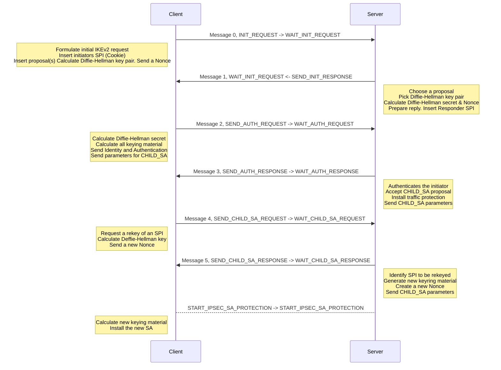


## Monitor and Debug IKEv2

### IKEv2 Monitor, Debug and Troubleshoot Commands

- List the IKE SA  & Child (IPsec) SA:
```
> diagnose vpn ike gateway list
> diagnose vpn ike gateway clear
> diagnose vpn tunnel list
```

- Ikev2 debug command is the same as the IKEv1 debug command:
```
> diagnose vpn ike log-filter dst-addr4 <remote peer ip>
> diagnose debug application ike -1
> diagnose debug enable

```

# Routing

## General Concepts and Troubleshooting

### Route Lookup

- For any session, FortiGate performs a routing table lookup twice
  - On the first packet the originator sends
  - On the first reply packet that the responder sends
- Routing information is written to the session table and route cache
- Exception: After a routing change, route information is flushed from the affected sessions and route cache entries
  - So, additional routing table lookups are required after


### Route Lookup Process

```
> diagnose firewall proute list
> diagnose ip rtcache list
> get router info routing-table all
> get router info kernel
```

### Route Selection Process

1. Most specific route
2. Lowest distance
3. Lowest metric ( dynamic routes )
4. Lowest priority ( static route )
5. ECMP ( static, BGP and OSPF routes )


### Static Routes

- FortiGate places a configured static route in th erouting table if the route meets the following requirements:
  - The outgoing interface is up
  - There is no duplicate route with a lower distance
  - The link health monitor (if configured) is up


  ### Reverse Path Forwarding

  - Protects against IP spoofing attacks and routing loops
  - Checks the source IP address
  - Is carried out on the first packet when the session is created
  - If the check fails, the debuig flow shows:
    ```
    > reverse path check fail, drop
    ```
```
> get router info routing-table all
```

### Return Packet Routing

- FortiGate remembers the interface to the source for the return packets
- Return packets are routed through the interface, even if there a better route through a different interface
- This ensures the same route path is used for both directions ( symmetric routing)

```
> diagnose sys session list
> diagnose sniffer packet any "host 10.4.0.1 and icmp" 4
```

### Asymmetric Routing

- The server sends an echo request to the PC
- The PC responds with an echo reply
- The echo reply is dropped no session is matched
- All subsequent echo replies are also blocked

- Allowing Assymetric routing:
```
config system settings
set asymroute enable
end
```

### Routing Changes Without SNAT

- After a routing change, routing information is flushed from the affected sessions where source NAT (SNAT) is not applied
  - Routing lookups are done again for the next packets
  - Route cache entries are removed
  - The session is flagged as dirty
- Example of a session just after a routing change
  - Dirty flag set, interface and gateway information removed.


- You can modify the default behavior on the CLI
```
config system interface
  edit <interface>
    set preserve-session-route { enable | disable }
  next
end
```
- disable: FortiGate flushes all routing information from the session table after a route change, and performs a new routing lookup for new packets
- enable: FortiGate marks existing session routing information as persistant, and applies only the modified routes to new sessions

- The current route must still be present in the FIB
  - Otherwise, FortiGate flags the session as dirty and reevaluates it

  - Session is flagged as route_preserve
  ```
  config system interface
    edit "T_INET_0"
      set preserve-session-route enable
    next
  end
  ```
  ```
  > diagnose sys session list
  > diagnose netlink interface | list grep index=19
  ```

### Routing Changes and SNAT Sessions

- By default, SNAT sessions are not flagged as dirty after a routing change
  - Exception: route in use removed from FIB
- Force reevaluation of SNAT sessions after a routing change (default=disable):
```
config system global
  set snat-route-change enable | disable
end
```
- If SNAT IP changes during reevaluation, packet droppped and session cleared

- Enable snat-route-change iuf using same IP pool for on and new paths

### ECMP Acceleration with Auxiliary Session

- When you enable this setting, FortiGate accelerates ECMP traffic to the NP6 processor
```
config system settings
  set auxiliary-session [disable | enable]
end
```
- Two sessions are created in case of a route change: the main session and auxiliary session
- FortiGate can offload the main session and auxiliary session to the NP6 processor, if the policy allows offloading

### Routing Table

```
> get router info routing-table all
```

### Routing Table Database

```
> get router info routing-table database
```

### FIB

```
> get router info kernel
```

### Route Cache

```
> diagnose ip rtcache list
```

### Policy Route Table

```
diagnose firewall proute list
```

# BGP

## BGP Review

### AS

- Set of routers and networks under the same, consistent administration
- an AS administrator is free to choose any internal routing architecture
  - OSPF, RIP and so on
- Each AS is identified by a unique number

### BGP Components

- Speaker or peer
  - Router that transmits and receives BGP messages, an acts on those messages
  - Session
    - Connectivity between two peers

### RIBs

  - Routes are stored in routing information bases (RIBs)
    - RIB-in
      - Routing information learned from inbound update messages
      - Contains unprocessed routing information advertised to the local BGP speaker by its peers
    - Local RIB
      - Routing information that the BGP speaker selects after applying its local policies to the RIB-in
    - RIB-out
      - Routing information that the local BGP speaker selects to advertise to its peers


### BGP attributes

- BGP processes routes based on path information
- A path is a route to a destination
  - Paths are described by a set of attributes, including an AS list
  - The attributes help routers select the route to each destination

- BGP path attribute categories
  - Well-known mandatory
    - Attributes are mandatory
  - Well-known discretionary
    - Attributes may or may not be included
  - Optional transitive 
    - Attributes may or may not be accepted and can be passed outside of the local autonomous system
  - Optional non-transitive
    - Attributes may or may not be accepted and can't be passed outside of the local autonomous system


  |Attribute|Category|
|-------|-------|
|ORIGIN|Well-known mandatory|
|AS_PATH|Well-known mandatory|
|NEXT_HOP|Well-known mandatory|
|MULTI_EXIT_DISC|Optional non-transitive|
|LOCAL_PREF|Well-known discretionary|
|ATOMIC_AGGREGATE|Well-known discretionary|
|AGGREGATOR|Operational transitive|
|COMMUNITY|Operational transitive|


### Route Selection

- Route selection tie breakers.
  1. Highest weight
  2. Highest local preference
  3.  Route originated by the local router (next hop = 0.0.0.0)
  4. Shortest AS path
  5. Lowest origin type
  6. Lowest multi-exit discriminator (MED)
  7. Prefer external paths (EBGP) over internal paths (IBGP)
  8. Path through closest IGP neighbor
  9. Oldest route for the EBGP paths
  10. Lowest neighbor BGP router ID
  11. Lowest neighbor IP address

  ## BGP Monitoring
  
  ### BGP States

- Idle: Initial state
- Connect: Waiting for a successful three-way TCP connection
- Active: Unable to establish the TCP session
- OpenSent: Waiting for an OPEN message from the peer
- OpenConfirm: Waiting for the keepalive message from the peer
- Established: Peers have successfully exchanged OPEN and keepalive messages

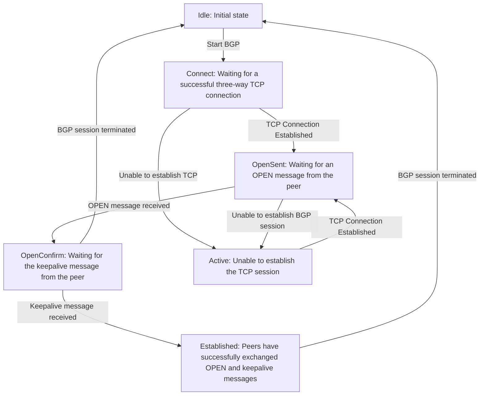

### BGP Summary

- Remote AS, packet count, uptime, state and prefixes received. 
```
> get router info bgp summary
```
### BGP Neighbors

- Neighbor, S, State, uptime, last update, messages stats, prefixes, connection stats
```
> get router info bgp neighbors
```

### Prefixes Advertised by the Local FortiGate

- Nexthop, metrix, local pref, weight, path, tag, version, router id, status
```
> get router info bgp neighbors <neighbor_ip> advertised-routes
```

### Prefixes Advertised by a Neighbor

```
> get router info bgp neighbors <neighbor_ip> route
```

### Prefixes Advertised by All BGP Peers

```
> get router info bgp network
```

### BGP Event Logging

- BGP event logging displays routing events
  - Neighbor down or up
  - RIB update
  - BGP message exchange
  - Errors connecting to neighbors
- Enabled by default  
```
config router bgp
  set log-neighbor-changes disable
end
```
- GUI
  - Log & report > System Events > Router Events


## BGP Troubleshooting

### BGP Troubleshooting Tips

- Is there an active route to the remote peer
- Check whether TCP port 179 is blocked
- Check the status of the TCP session
- Check the status of the BGP session
- Check the prefixes received and advertised


### Real-Time Debug

- Enable real-time BGP debug
```
> diagnose ip router bgp all enable
> diagnose ip router bgp level info
> diagnose  debug enable
```

- Disable real-time BGP debug
```
> diagnose ip router bgp all disable
> diagnose ip router bgp level none
> diagnose bgp disable
```

### Restart BGP

```
> execute router clear bgp
```


# OSPF

## OSPF Review

### OSPF Overview

- Link state protocol
- Advantages
  - Scalable to large networks
  - Faster convergence than distance-vector routing protocols
  - relatively quiet during steady state conditions
    - Periodic refresh every 30 minutes
    - Otherwise, updates only sent when there are changes
- Disadvantages
  - May require planning and tuning to optimize performance
  - May be difficult to troubleshoot in large networks

### OSPF Components

- Link State database(LSDB): Each router maintains identical databases describing the network topology
- From the LSDB, and using Dijkstra's algorithm, each router builds a tree with the shortest paths
- The tree gives an OSPF route to each destination
- OSPF can inject routes into the IP routing table

### Link State Advertisement

- Routers exchange link state advertisements (LSAs) to maintain consistent databases
  - Network changes generates LSAs
  - The LSDBs are composed of all received LSAs
- A link state update consists of an OSPF header and a string of LSAs
  - Each LSA has its own header
  - Routers acknowledge the receipt of LSAs

### Forming an Adjacency

- Down: Initial state
- Init: A hello packet was seen from a non-adjacent neighbor
- 2-way: Communication is bidirectional between the two routers
- ExStart: A primary and secondary relationship is negotiated
- Exchange: Database description packets are exchanged
- Loading: LSA information is exchanged
- Full: LSDBs are identical

### Adjacency Requirements

- Requirements for forming an adjacency:
  - Primary IP addresses of peers are in the same subnet with the same mask
  - Interfaces of peers are the same type and in t he same OSPF area
  - Hello and dead intervals of peers match
  - Each peer has an unique router ID
  - OSPF IP MTUs match
  - OSPF authentication, if enabled, is successful

  ## OSPF Monitoring

  ### OSPF Status
  
  ```
  > get router info ospf status
  ```

  ### OSPF interfaces

  ```
  > get router info ospf interface
  ```


### OSPF Neighbors

```
get router info ospf neighbor
```


### OSPF LSDB

```
> get router info ospf database brief
```

### OSPF Self-Originated LSAs

```
> get router info ospf database self-originate
```

### LSA Details

```
> get router info ospf database router lsa

```

## OSPF Troubleshooting 

### OSPF Troubleshooting Tips

- Do Peers have an IP address within the same subnet?
- Is IP proitocol 89 blocked?
- Do the hello and dead intervals match?
- Is the router ID unique?
- Do the MTUs match?
- Is authentication enabled?

- Enable real-time debug
```
> diagnose ip router ospf all enable
> diagnose ip router ospf level info
> diagnose debug enable
```

- Disable real-time debuig
```
> diagnose ip router ospf all disable
> diagnose dbeug disable
```

- Restart OSPF process
```
> execute router clear ospf process
```

- By default, routing real-time debugs stop running after you restart the routing process
  - Enable the zl flag to have the real-time debuig persist after the process restart
  ```
  > diagnose ip router zl enable
  ```

  ### Failed Adjacency Error Messages

  - Authentication Error
    - Authentication type is the same, but passwords do not match

  - HelloInterval mismatch/RouterDeadInterval mismatch
    - Hello/dead interval timer mismatch
  - MTU size is too large
    - MTU mismatch


### Advertised Route Not in Routing Table

```
> show router ospf
config router ospf
  set router-id 0.0.0.112
  config area
    edit 0.0.0.0
    next
  end
...
  config redistribute "static"
    set status enable
  end
...
end  

```

```
> get router info routing-table all
> get router info ospf database brief
```

- Example shows distribution list that denies 8.8.8.0 being injected into routing table
```
> show router ospf
config router ospf
  set router-id  0.0.0.113
  set distribution-list-in "Deny-8.8.8.0/24"
  config area
    edit 0.0.0.0
    next
  end
...
end
```

```
> show router prefix-list
config router prefix-list
  edit "Deny-8.8.8.0/24"
    config rule
      edit 1
        set action deny
        set prefix 8.8.8.0 255.255.255.0
        unset ge
        unset le
```
- Rules are not processed top down, but inspected.
- By adding set prefix 8.8.8.8 255.255.255.255 to Deny-8.8.8.0/24 prefix list to allow OSPF updates  from 8.8.8.8
```
> show router prefix-list
config router prefix-list
  edit "Deny-8.8.8.0/24"
    config rule
      edit 1
        set action deny
        set prefix 8.8.8.0 255.255.255.0
        unset ge
        unset le
      edit 2
        set prefix 8.8.8.8 255.255.255.255
        unset ge
        unset le
      next
    end
  next
end
```

### OSPF Logging
- FortiGate logs OSPF routing events, such as
  - Neighbor down or up
  - OSPF message exchange
  - Negotiation errors
- Enabled by default under
```
> coonfig router ospf
  set log-neighbor-change enable
  ...
end
```

- GUI Log & Report > Events > Router Events


