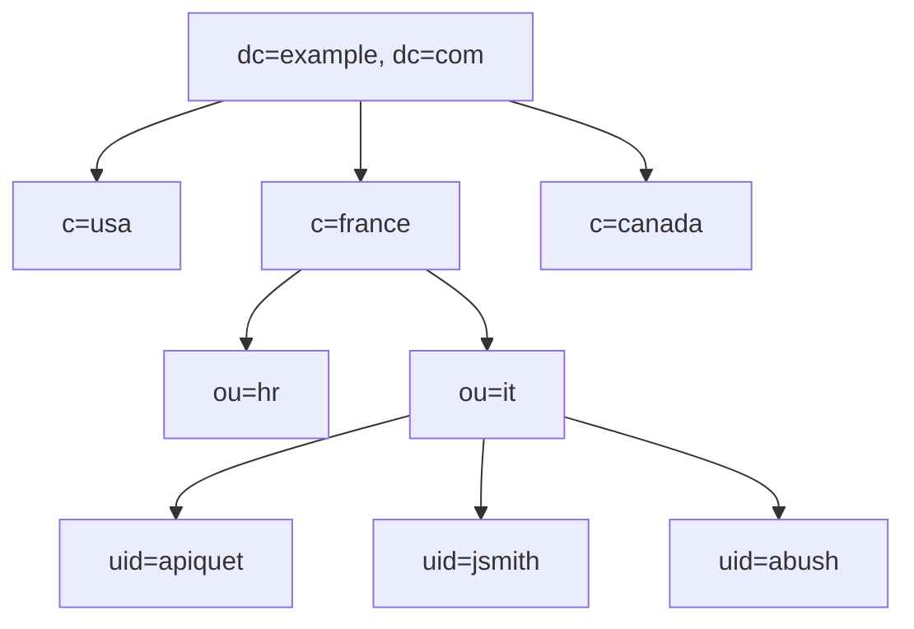
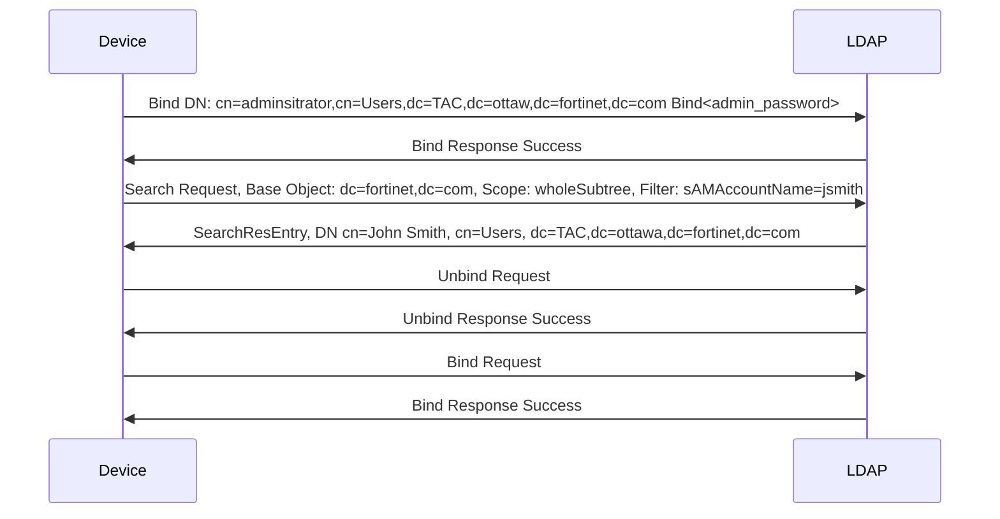
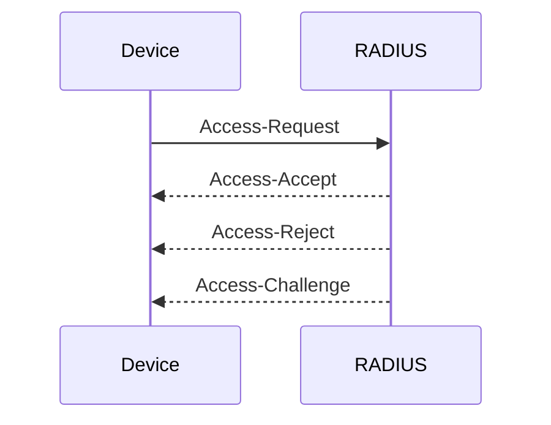

# Connectivity
- Connect
    - Browser to connect to IP interface for admin access.
    - Login
    - GUI Dashboard displayed by default.
    
# Interfaces and Routing
Fortigate Interface settings:
- Alias:
- IP
- Administrative Access
- DHCP servers


# Security Fabric
- Intelligent architecture interconnecting security solutions
   - Detects, blocks, and remediates attacks across attack surface
- Supports Hardware, Virtual, Cloud

## Security Fabric Components
- Core
   - Root FortiGate
   - Downstream FortiGate
   - FortiAnalyzer or Fortinet Cloud logging Service
- Recommended
   - FortiManager, FortiAP, FortiSwitch, FortiClient, FortiSandbox, FortiMail
- Extended 
   - Other Fortinet products and third-party products using the API
    
## Security Fabric Communications
- Protocols
  - Uses TCP:8013
   - Always on
   - Must be manually enabled on FortiGate interface under Adminsitrative Access
    
- Neighbor Discovery
  - Uses UDP:8014
  - Broadcast messages every 60 seconds
  - Responsible for security logging behavior

### Troubleshooting Communication
- Unable to connect to root
- Common Issues
  -  Administrative access disabled for Security Fabric on upstream FortiGate
  - FortiOS firmware mismatch
  - Device has not been authorized yet on root
  - Wrong root IP address
  - FortiGate not in NAT mode
  - TCP port 8013 blocked
  - UDP port 8014 

### Downstream Communication Issues
> FortiTelemetry disabled
```
> diagnose sniffer packet any "tcp port 8013 or udp port 8014" 4
```

> Troubleshooting FortiGate paring root, non-root.
```
> diagnose test application csfd 1
```

> Gather upstream and downstream device information.
```
> diagnose sys csf upstream
> diagnose sys csf downstream
> diagnose sys csf global
```

### Real-Time Application Debug
- csfd is the daemon responsible for anything related to the Security Fabric
- Useful to troubleshoot issues such as a frozen GUI

```
> diagnose debug application csfd -1
> diagnose debug enable
```


### High CPU Usage Caused by csfd
- Outputs to gather if csfd causes high CPU
- Helpful for Fortinet Support

```
> diagnose debug application csf -1
> diagnose debug enable

> diagnose sys process dump <csfd_pid>
> diagnose sys process pstack <csfd_pid>
> diagnose sys process trace <csfd_pid>
```

### High Memory Usage caused by csfd
- Outputs to gather if csfd causes high memory usage

```
> diagnose  test application csfd 1 - show stats
> diagnose  test application csfd 4 - start diagnostic collection
> diagnose  test application csfd 7 - print diagnostics stats
> diagnose  test application csfd 10 - show query cache status
> diagnose  test application csfd 30 - show process information
> diagnose  test application csfd 40 - show MAC cache status
> diagnose  test application csfd 100 - Dump registered elements
> diagnose  test application csfd 130 - List of open sockets
> diagnose  test application csfd 142 - List of unconfirmed open msgs
> diagnose  test application csfd 150 - Dump table counts

```

## Automation Stitches 
- Automate actions among different systems in the Security Fabric
  - Decrease response times to security events
- Can be configured only on the root
- Events within the entire Security Fabric can be monitored
- Consists of a trigger and an action(s)
  - Trigger: an event that triggers an action, such as a failed login attempt
  - Action: the resulting response to the trigger, such as a notification email sent to the administrator
  - You can set a minimum interval to avoid too many notifications
- Use CLI commands to test, log and display settings and statistics
  - Can be run from any Fortigate in the Security Fabric


### Automation Stitches Testing
- Manually test an automation stitch
```
> diagnose automation test
> diaggnose automation test HAFailOver
```

### Automation Stitches Debug
- Real-time application debug
```
> diagnose debug application autod -1
> diagnose debug enable
> diagnose automation test ConfigurationChange
```

### Automation Stitches Log Dumping
- Enable log dumping to view log statistics
```
> diagnose test application autod 1 # Enable
> diagnose test application autod 1 # Disable
```

### View Automation Stitch Settings
```
> diagnose test application autod 2
```

### View Automation Stitch Statistics
```
> diagnose test application autod 3
```

### View Running Automation Stiches
```
FGTVM-2 # diagnose test application autod 5
```

# Firewall Authentication
## Diagnostic Steps for Authentication Issues
- Fortigate using LDAP, NTLM, RADIUS and so on
  - Can users authenticate?
  - Are users being given the proper permission
- What do the event logs show?
  - Was authentication successful at first but problems ocurred later?
  - Is the username correct?
- What do the logs show?
  - Is traffic being blocked?
  - Are users being treated with the proper profiles?
- What do the server logs show?
  - FortiGate bases decisions on server responses

## Monitoring Authenticated Users
- Firewall User Monitor is not on the GUI by default, it must be enabled.

```
> diagnose firewall auth filter [source | policy | user | group | method]
> diagnose firewall auth list
```

## Authentication Real-Time Debug
```
> diagnose debug application authd -1
```

## LDAP Tree Example

> (DN: uid=jsmith, ou=it, c=france, dc=example, dc=com)

## LDAP Regular Bind flow -- Group Query



## Common LDAP misconfigurations
- Common Name Identifier
  - cn for full name
  - sAMAccountName for login-name

- Distinguished Name
- Username
- Password

## Windows AD Regular Bind Configuration
- To see the DN
```
> dsquery user -name <full_user_name>
> dsquery user -samid <login_username>
```
## Authentication Test Command
```
> diagnose test authserver ldap <server_name> <user> <password>
```

## LDAP Real-Time Debug
```
> diagnose debug application fnbamd -1
> diagnose debug enable
```

## LDAP Sniffer
```
> diagnose sniffer packet any "port 389" 3
```
- Error Codes
  - 0x525: user not found
  - 0x52e: invalid credentials
  - 0x530: not permitted to logon at this time
  - 0x531: not permitted to logon from this workstation
  - 0x532: password expired
  - 0x533: account disabled
  - 0x701: account expired
  - 0x773: user must reset password
  - 0x775: account locked out

## Common Problems
- User Not Found
```
get_all_dn-Found no DN
start_next_dn_bind-No more DN left
```
- Wrong User Password
```
fnbamd_ldap_get_result-Auth Denied
```
- Groups Not Found
```
> get_member_of_groups-attr='groups' - found 0 values
```

## RADIUS Authentication Troubleshooting



### Testing RADIUS Queries
- Supported Schemes
  - chap
  - pap
  - mschap
  - mschap2
```
> diagnose test authserver radius <server_name> <scheme> <user> <password>
```

### RADIUS Real-Time Debug
```
> diagnose debug application fnbamd -1
> diagnose debug enable
```

# Fortinet Single Sign-On (FSSO)
